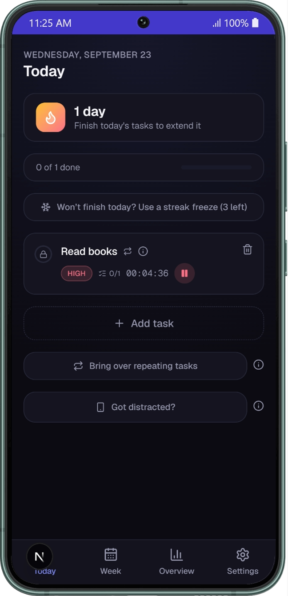
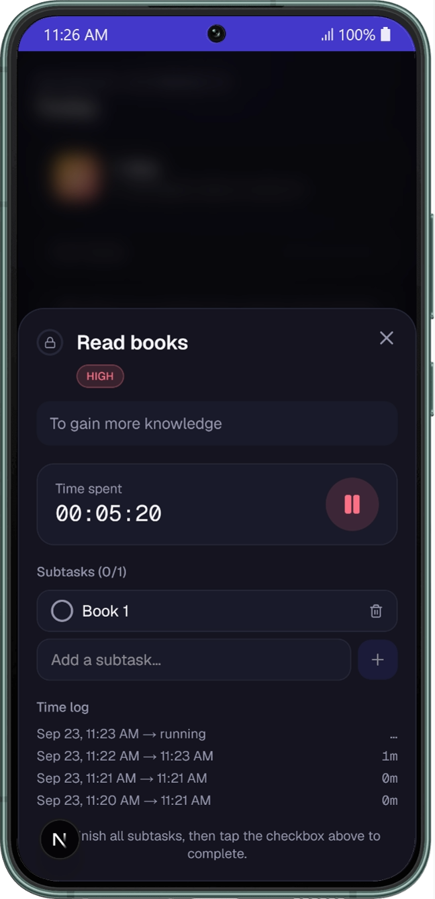
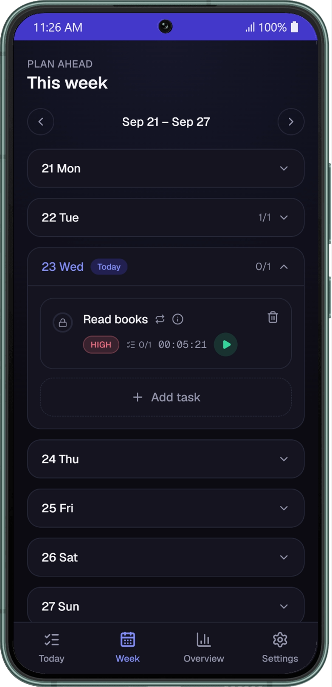
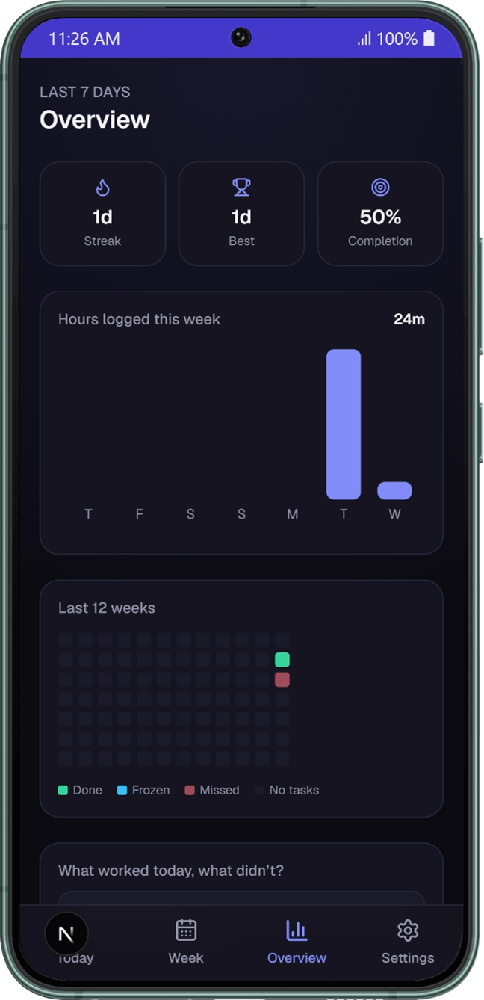
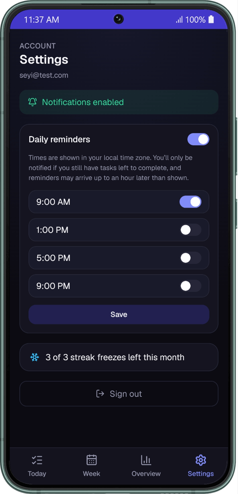

# Consistency

A simple app for planning your day, tracking how long things actually take,
and building a streak of days where you got everything done.

**Try it here:** [useconsistency.vercel.app](https://useconsistency.vercel.app/)

## Screenshots

<table>
  <tr>
    <td width="180" valign="top"></td>
    <td valign="top">
      <h3>Today: your whole day, one screen</h3>
      Everything planned for today lives here: a live streak counter, a progress bar, and each task with its priority and timer sitting right on the card. Check things off as you go and watch the day fill in.
      <ul>
        <li>Streak banner shows how many days you've strung together</li>
        <li>Priority tags and a live timer, right on the task card</li>
        <li>One tap to mark a task complete</li>
      </ul>
    </td>
  </tr>
  <tr>
    <td width="180" valign="top"></td>
    <td valign="top">
      <h3>Task detail: tap into any task for more</h3>
      Every task opens into its own view: a full-size timer you can pause and resume, a checklist of subtasks, and a running log of every session so you know exactly where the time went.
      <ul>
        <li>Pause and resume without losing your total</li>
        <li>Break a task into smaller subtasks and tick them off one by one</li>
        <li>A full log of every start and stop, with duration</li>
      </ul>
    </td>
  </tr>
  <tr>
    <td width="180" valign="top"></td>
    <td valign="top">
      <h3>Week: plan the whole week, not just today</h3>
      Every day gets its own row: expand it, add tasks, and see how it's going, so you're never stuck planning one day at a time.
      <ul>
        <li>Expand any day to see or add its tasks</li>
        <li>Each day shows a quick completion count, like 1/1</li>
        <li>Today is marked so you always know where you are</li>
      </ul>
    </td>
  </tr>
  <tr>
    <td width="180" valign="top"></td>
    <td valign="top">
      <h3>Overview: see the pattern, not just the day</h3>
      A rolling heatmap of your last 12 weeks, hours logged per day, and your current streak next to your best one ever, all in one glance.
      <ul>
        <li>12-week heatmap: done, frozen, missed, or no tasks planned</li>
        <li>Hours logged this week, charted by day</li>
        <li>Current streak next to your longest one</li>
      </ul>
    </td>
  </tr>
  <tr>
    <td width="180" valign="top"></td>
    <td valign="top">
      <h3>Settings: reminders that respect your time</h3>
      Turn on up to four check-ins a day. Each one skips you entirely if there's nothing left to finish, so you're never nagged for no reason.
      <ul>
        <li>Up to 4 reminder times, each independently on or off</li>
        <li>Skipped automatically once everything's done</li>
        <li>3 streak freezes a month, tracked right here</li>
      </ul>
    </td>
  </tr>
</table>

## What it does

Every day, you write down what you need to get done. As you finish things,
you check them off. When *everything* for the day is checked off, that day
counts toward your streak: a running count of how many days in a row you've
followed through.

A few things make it more than just a checklist:

- **A live timer on any task.** Tap start when you begin, pause if you get
  pulled away, and it keeps a running total of how long you actually spent.
  You can look back later and see exactly when you worked on something and
  for how long.

- **Subtasks.** Break a bigger task into smaller pieces. For example, a task
  like "read this week" could have each book as its own checkbox underneath.
  Finish the last one and the main task ties itself off automatically.

- **Plan the whole week.** Not just today: every day gets its own row you
  can expand, add tasks to, and check progress on, so you're never stuck
  planning one day at a time.

- **Streak freezes.** Life happens. You get 3 free passes a month so one
  rough day doesn't erase a long streak.

- **Repeating tasks.** For things you do most days, mark them as repeating
  once, then tap a button each morning to pull them onto today's list instead
  of retyping them.

- **Reminders.** Set up to 4 notification times a day. Each one only
  actually pings your phone if you've still got something left to finish, so
  they never nag you for no reason.

- **A weekly overview.** A calendar-style view of your recent streak, how
  many hours you logged, and what you actually got done, so you can look back
  and notice patterns instead of just guessing.

- **Works like an app on your phone.** Open it in your phone's browser, add
  it to your home screen, and it behaves like any other installed app, icon
  and all. No app store needed.

Everything is private to your own account. Nobody else can see your tasks,
your timers, or your streak.

## Try it

Open **[useconsistency.vercel.app](https://useconsistency.vercel.app/)**,
create an account with your email and a password, and start adding tasks for
today. On your phone, open the same link in Chrome, tap the menu, and choose
"Add to Home screen" to install it properly.

---

## For developers

The rest of this document is for whoever's running or modifying the code
itself.

### What it's built with

- **Next.js** (React) for the app itself, deployed on **Vercel**
- **Supabase** (Postgres) for the database, accounts, and login
- The **Web Push API** for phone notifications, sent on a schedule by
  Vercel's cron jobs

### 1. Create a Supabase project

1. Go to [supabase.com](https://supabase.com), create a free project.
2. Open **SQL Editor → New query**, paste the contents of [`supabase/schema.sql`](supabase/schema.sql), and run it. This creates all the tables, row-level security policies, and the trigger that creates a profile row on signup.
3. Go to **Project Settings → API** and copy:
   - `Project URL` → `NEXT_PUBLIC_SUPABASE_URL`
   - `anon public` key → `NEXT_PUBLIC_SUPABASE_ANON_KEY`
   - `service_role` key → `SUPABASE_SERVICE_ROLE_KEY` (keep this secret: it bypasses row-level security and is only used server-side by the notification cron)
4. Paste all three into `.env.local` (they're currently blank).
5. Optional but recommended: in **Authentication → Providers → Email**, turn off "Confirm email" if you don't want to click a confirmation link the first time you sign up, since this is just for you.

### 2. Run it locally

```bash
npm run dev
```

Open `http://localhost:3000`, sign up with your email/password on the login screen (this creates your one account), and you're in.

### 3. Deploy

1. Push this repo to GitHub, then import it into [Vercel](https://vercel.com).
2. In the Vercel project's **Settings → Environment Variables**, add everything from `.env.local`:
   `NEXT_PUBLIC_SUPABASE_URL`, `NEXT_PUBLIC_SUPABASE_ANON_KEY`, `SUPABASE_SERVICE_ROLE_KEY`, `NEXT_PUBLIC_VAPID_PUBLIC_KEY`, `VAPID_PRIVATE_KEY`, `VAPID_SUBJECT` (set this to `mailto:your-real-email`), and `CRON_SECRET`.
3. Deploy. `vercel.json` already defines four daily cron jobs (`/api/cron/notify/1` at 08:00 UTC, `/2` at 12:00, `/3` at 16:00, `/4` at 20:00) that Vercel will call automatically. No extra setup needed.
4. On your phone, open the deployed URL in Chrome, tap the menu → **Add to Home screen**. That's your "app."
5. Open it once installed, go to **Settings → Enable notifications**, and grant permission when Android prompts you.

#### About notification timing

Vercel's free (Hobby) plan only allows cron jobs to run **once a day at a fixed time**, so the four reminders fire at fixed UTC times (08:00 / 12:00 / 16:00 / 20:00), each with up to an hour of flex on Hobby. Settings reflects this honestly: it's 4 on/off toggles showing those times converted to your local time zone, not a free-time picker, since anything more precise isn't actually achievable on this plan. Each slot only sends a notification if there are still unfinished tasks, so an unused slot is harmless. If you want real per-minute control, point a free external pinger (e.g. [cron-job.org](https://cron-job.org)) at `https://your-app.vercel.app/api/cron/notify/1` through `/4` on whatever schedule you like, with an `Authorization: Bearer <CRON_SECRET>` header (same secret you put in Vercel's env vars). Either way, delete or ignore the ones in `vercel.json` if you go this route.

### Project structure

- `supabase/schema.sql`: the whole database schema, run once in Supabase for a fresh project.
- `supabase/migrations/`: incremental changes to run if your project already existed before that change (each file says so).
- `src/lib/actions.ts`: all task/timer/streak/reflection mutations (Next.js server actions).
- `src/lib/streak.ts`: the streak math (what counts as a "won" day, current/longest streak).
- `src/app/(main)/*`: the four main screens, behind a bottom nav on mobile and a sidebar on desktop (>=1024px).
- `src/app/page.tsx`: the public landing page at `/`, shown to signed-out visitors.
- `src/app/api/cron/notify/[slot]`: the notification endpoint Vercel (or your own pinger) calls once per configured slot (1-4).
- `public/sw.js`: the service worker (installability + push notification handling).
- `public/screenshots/`: the images used on the landing page and in this README.
